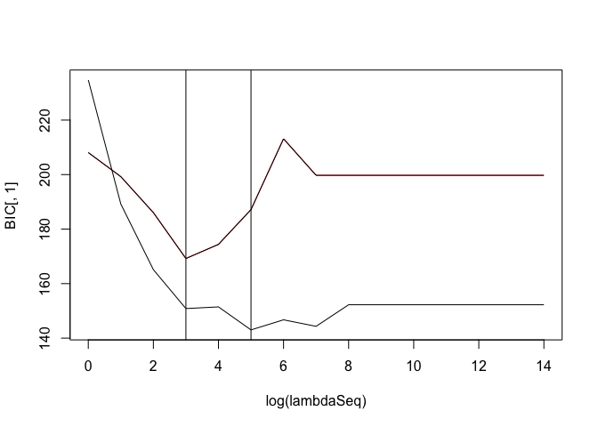

<!-- README.md is generated from README.Rmd. Please edit that file -->
detrendr
========

The goal of detrendr is to estimate smooth quantile trends in evenly spaced series. Missing values are allowed.

Installation
============

You can install the development version of detrendr from [Github](https://github.com/halleybrantley/detrendr) with:

``` r
library(devtools)
#install_github("halleybrantley/detrendr")
load_all()
#> Loading detrendr
#> Loading required package: Matrix
#> 
#> Attaching package: 'testthat'
#> The following objects are masked from 'package:devtools':
#> 
#>     setup, test_file
```

Example
-------

Estimate the 5th and 20th quantile trends using a fixed value of the smoothing parameter *λ*.

``` r
library(detrendr)
n <- 100
x <- seq(1, n, 1)
y <- sin(x*2*pi/n) + rnorm(n, 0, .4)
lambda <- 10
k <- 3
tau <- c(0.05, .2)
trend <- get_trend(y, tau, lambda, k)
#> Using same lambda for all quantiles
plot(y~x, type="l", col="grey")
lines(trend[,1]~x, col="red")
lines(trend[,2]~x, col="blue")
```


Use eBIC criterion to choose smoothing parameter:

``` r

trend_fit <- get_trend_BIC(y, tau, k, plot_lambda = TRUE)
#> Using same lambda for all quantiles
```



``` r
trend <- trend_fit$trend
plot(y~x, type="l", col="grey")
lines(trend[,1]~x, col="red")
lines(trend[,2]~x, col="blue")
```


Use ADMM algorithm for long time series:

``` r
library(ggplot2)
library(splines)
set.seed(987651)
overlap <- 150 
window_size <- 500 
n <- window_size*3 - overlap*2
df.data <- generate_peaks(n)
df.data$x <- seq(1, n, 1)
tau <- c(0.05, 0.1)

lambda <- length(df.data$y)
max_iter <- 25
trend1 <- get_trend(df.data$y, tau, lambda, k=3)
#> Using same lambda for all quantiles

trend2 <- get_trend_windows(df.data$y, tau, lambda, k=3,
                            window_size, 
                            overlap, 
                            max_iter=40, update = 1, 
                            rho = 1, eps_abs = 0.01, 
                            scale=FALSE)
#> Using same lambda for all quantiles
#> Using same lambda for all quantiles
#> Using same lambda for all quantiles
#> [1] "Iteration: 1 Primal Resid Norm: 0.9107 eps_pri: 0.5056, Dual Resid Norm: 0.9182  eps_dual 0.4912"
#> [1] "Iteration: 2 Primal Resid Norm: 0.7083 eps_pri: 0.5056, Dual Resid Norm: 0.6741  eps_dual 0.4912"
#> [1] "Iteration: 3 Primal Resid Norm: 0.6067 eps_pri: 0.5056, Dual Resid Norm: 0.5211  eps_dual 0.4912"
#> [1] "Iteration: 4 Primal Resid Norm: 0.5085 eps_pri: 0.5056, Dual Resid Norm: 0.4339  eps_dual 0.4913"
#> [1] "Iteration: 5 Primal Resid Norm: 0.4699 eps_pri: 0.5056, Dual Resid Norm: 0.3979  eps_dual 0.4914"
#> [1] "Converged in 5 iterations"


df_no <- rbind(data.frame(x=df.data$x , method = "Single Fit", trend1), 
               data.frame(x=df.data$x , method = "Windows", trend2))


ggplot(df.data, aes(x=x, y=y)) +
  geom_line(col="grey") +
  geom_line(data = df_no, aes(y=X1, col = "0.05", linetype = method))+
  geom_line(data = df_no, aes(y=X2, col = "0.10", linetype = method))+
  scale_color_brewer(palette = "Set1")+
  labs(col="Quantile", linetype = "", x = "") + 
  theme_bw() 
```


