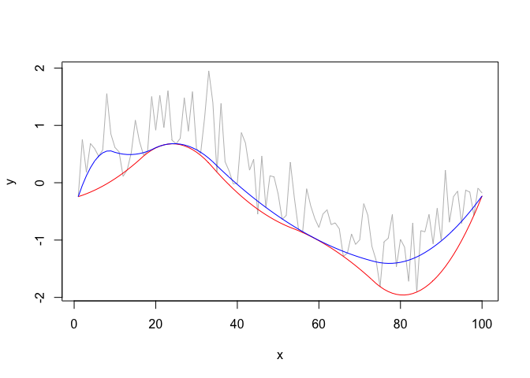
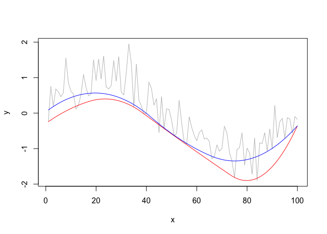

<!-- README.md is generated from README.Rmd. Please edit that file -->
detrendr
========

The goal of detrendr is to estimate smooth quantile trends in evenly spaced series. Missing values are allowed.

Installation
============

You can install the development version of detrendr from [Github](https://github.com/halleybrantley/detrendr) with:

``` r
library(devtools)
install_github("halleybrantley/detrendr")
```

Example
-------

Estimate the 5th and 20th quantile trends using a fixed value of the smoothing parameter *λ*.

``` r
library(detrendr)
#> Loading required package: Matrix
n <- 100
x <- seq(1, n, 1)
y <- sin(x*2*pi/n) + rnorm(n, 0, .4)
lambda <- 10
k <- 3
tau <- c(0.05, .2)
trend <- get_trend(y, tau, lambda, k)
#> Using same lambda for all quantiles
plot(y~x, type="l", col="grey")
lines(trend[,1]~x, col="red")
lines(trend[,2]~x, col="blue")
```



Use eBIC criterion to choose smoothing parameter:

``` r

trend_fit <- get_trend_BIC(y, tau, k, plot_lambda = TRUE)
#> Using same lambda for all quantiles
#> [1] "i=1 lambda=1.000000"
#> [1] "i=2 lambda=2.718282"
#> [1] "i=3 lambda=7.389056"
#> [1] "i=4 lambda=20.085537"
#> [1] "i=5 lambda=54.598150"
#> [1] "i=6 lambda=148.413159"
#> [1] "i=7 lambda=403.428793"
#> [1] "i=8 lambda=1096.633158"
#> [1] "i=9 lambda=2980.957987"
#> [1] "i=10 lambda=8103.083928"
#> [1] "i=11 lambda=22026.465795"
#> [1] "i=12 lambda=59874.141715"
#> [1] "i=13 lambda=162754.791419"
#> [1] "i=14 lambda=442413.392009"
#> [1] "i=15 lambda=1202604.284165"
```


``` r
trend <- trend_fit$trend
plot(y~x, type="l", col="grey")
lines(trend[,1]~x, col="red")
lines(trend[,2]~x, col="blue")
```


