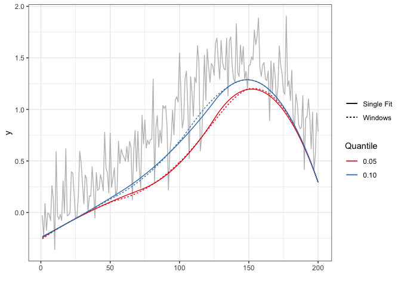

<!-- README.md is generated from README.Rmd. Please edit that file -->
detrendr
========

The goal of detrendr is to estimate smooth quantile trends in evenly spaced series. Missing values are allowed. The methods implemented in this package are described here: <https://arxiv.org/abs/1904.10582>.

Installation
============

You can install the development version of detrendr from [Github](https://github.com/halleybrantley/detrendr) with:

``` r
library(devtools)
install_github("halleybrantley/detrendr")
#> Skipping install of 'detrendr' from a github remote, the SHA1 (f4852fc9) has not changed since last install.
#>   Use `force = TRUE` to force installation
```

The functions are much faster when used with the Gurobi solver. Directions for obtaining a license and installing the gurobi package are available here: <https://cran.r-project.org/web/packages/prioritizr/vignettes/gurobi_installation.html>

Examples
--------

Estimate the 5th and 20th quantile trends using a fixed value of the smoothing parameter *λ*.

``` r
library(detrendr)
#> Loading required package: Matrix
n <- 100
x <- seq(1, n, 1)
y <- sin(x*2*pi/n) + rnorm(n, 0, .4)
lambda <- 10
k <- 3
tau <- c(0.05, .2)
trend <- get_trend(y, tau, lambda, k)
#> Using same lambda for all quantiles
plot(y~x, type="l", col="grey")
lines(trend[,1]~x, col="red")
lines(trend[,2]~x, col="blue")
```


Use eBIC criterion to choose smoothing parameter:

``` r

trend_fit <- get_trend_BIC(y, tau, k, plot_lambda = TRUE)
#> Using same lambda for all quantiles
```


``` r
trend <- trend_fit$trend
plot(y~x, type="l", col="grey")
lines(trend[,1]~x, col="red")
lines(trend[,2]~x, col="blue")
```


Use ADMM algorithm for long time series:

``` r
library(ggplot2)
library(splines)
set.seed(987651)
overlap <- 50 
window_size <- 100 
n <- window_size*3 - overlap*2
df.data <- generate_peaks(n)
df.data$x <- seq(1, n, 1)
tau <- c(0.05, 0.1)

lambda <- length(df.data$y)
max_iter <- 25
trend1 <- get_trend(df.data$y, tau, lambda, k=3)
#> Using same lambda for all quantiles

trend2 <- get_trend_windows(df.data$y, tau, lambda, k=3,
                            window_size, 
                            use_gurobi = TRUE, # Change to FALSE if you do
                            # not have gurobi installed
                            overlap, 
                            max_iter=max_iter, update = 1, 
                            rho = 1, eps_abs = 0.01, 
                            scale=FALSE)
#> Using same lambda for all quantiles
#> Using same lambda for all quantiles
#> Using same lambda for all quantiles
#> [1] "Iteration: 1 Primal Resid Norm: 0.9016 eps_pri: 0.2066, Dual Resid Norm: 0.9299  eps_dual 0.2013"
#> [1] "Iteration: 2 Primal Resid Norm: 0.7210 eps_pri: 0.2065, Dual Resid Norm: 0.6984  eps_dual 0.2014"
#> [1] "Iteration: 3 Primal Resid Norm: 0.6679 eps_pri: 0.2064, Dual Resid Norm: 0.5735  eps_dual 0.2015"
#> [1] "Iteration: 4 Primal Resid Norm: 0.5604 eps_pri: 0.2064, Dual Resid Norm: 0.5313  eps_dual 0.2015"
#> [1] "Iteration: 5 Primal Resid Norm: 0.4890 eps_pri: 0.2063, Dual Resid Norm: 0.5031  eps_dual 0.2016"
#> [1] "Iteration: 6 Primal Resid Norm: 0.4050 eps_pri: 0.2063, Dual Resid Norm: 0.4837  eps_dual 0.2017"
#> [1] "Iteration: 7 Primal Resid Norm: 0.3698 eps_pri: 0.2063, Dual Resid Norm: 0.4246  eps_dual 0.2017"
#> [1] "Iteration: 8 Primal Resid Norm: 0.3254 eps_pri: 0.2063, Dual Resid Norm: 0.4178  eps_dual 0.2018"
#> [1] "Iteration: 9 Primal Resid Norm: 0.3195 eps_pri: 0.2063, Dual Resid Norm: 0.4059  eps_dual 0.2018"
#> [1] "Iteration: 10 Primal Resid Norm: 0.3284 eps_pri: 0.2062, Dual Resid Norm: 0.3397  eps_dual 0.2018"
#> [1] "Iteration: 11 Primal Resid Norm: 0.3432 eps_pri: 0.2062, Dual Resid Norm: 0.2828  eps_dual 0.2018"
#> [1] "Iteration: 12 Primal Resid Norm: 0.3442 eps_pri: 0.2062, Dual Resid Norm: 0.2355  eps_dual 0.2019"
#> [1] "Iteration: 13 Primal Resid Norm: 0.3402 eps_pri: 0.2062, Dual Resid Norm: 0.1845  eps_dual 0.2019"
#> [1] "Iteration: 14 Primal Resid Norm: 0.3206 eps_pri: 0.2062, Dual Resid Norm: 0.1916  eps_dual 0.2020"
#> [1] "Iteration: 15 Primal Resid Norm: 0.3060 eps_pri: 0.2062, Dual Resid Norm: 0.1999  eps_dual 0.2020"
#> [1] "Iteration: 16 Primal Resid Norm: 0.3009 eps_pri: 0.2062, Dual Resid Norm: 0.2019  eps_dual 0.2021"
#> [1] "Iteration: 17 Primal Resid Norm: 0.3039 eps_pri: 0.2062, Dual Resid Norm: 0.1852  eps_dual 0.2021"
#> [1] "Iteration: 18 Primal Resid Norm: 0.3035 eps_pri: 0.2062, Dual Resid Norm: 0.1660  eps_dual 0.2022"
#> [1] "Iteration: 19 Primal Resid Norm: 0.2954 eps_pri: 0.2062, Dual Resid Norm: 0.1722  eps_dual 0.2023"
#> [1] "Iteration: 20 Primal Resid Norm: 0.2882 eps_pri: 0.2062, Dual Resid Norm: 0.1734  eps_dual 0.2023"
#> [1] "Iteration: 21 Primal Resid Norm: 0.2833 eps_pri: 0.2062, Dual Resid Norm: 0.1726  eps_dual 0.2024"
#> [1] "Iteration: 22 Primal Resid Norm: 0.2800 eps_pri: 0.2062, Dual Resid Norm: 0.1716  eps_dual 0.2024"
#> [1] "Iteration: 23 Primal Resid Norm: 0.2681 eps_pri: 0.2062, Dual Resid Norm: 0.1781  eps_dual 0.2025"
#> [1] "Iteration: 24 Primal Resid Norm: 0.2652 eps_pri: 0.2062, Dual Resid Norm: 0.1537  eps_dual 0.2025"
#> [1] "Iteration: 25 Primal Resid Norm: 0.2612 eps_pri: 0.2062, Dual Resid Norm: 0.1449  eps_dual 0.2026"


df_no <- rbind(data.frame(x=df.data$x , method = "Single Fit", trend1), 
               data.frame(x=df.data$x , method = "Windows", trend2))


ggplot(df.data, aes(x=x, y=y)) +
  geom_line(col="grey") +
  geom_line(data = df_no, aes(y=X1, col = "0.05", linetype = method))+
  geom_line(data = df_no, aes(y=X2, col = "0.10", linetype = method))+
  scale_color_brewer(palette = "Set1")+
  labs(col="Quantile", linetype = "", x = "") + 
  theme_bw() 
```


